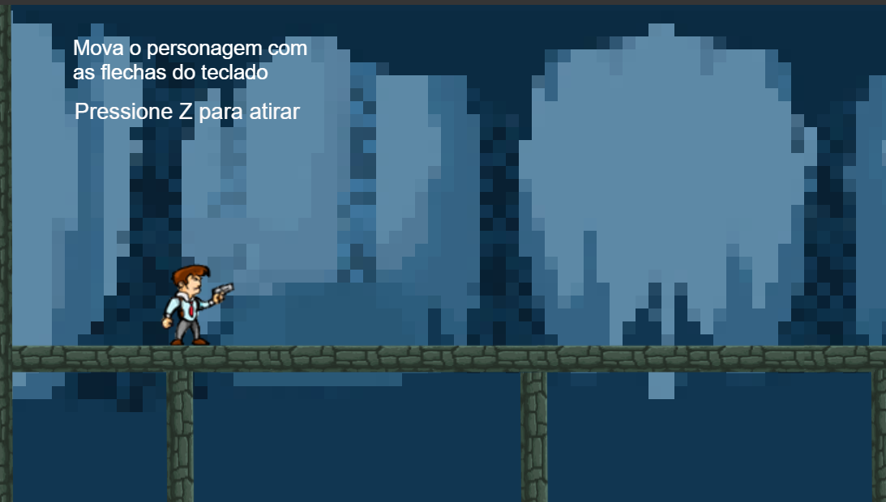

# TIRO COM CONSTRUCT
👨‍🏫O JOGADOR ASSUME A PERSPECTIVA DO PERSONAGEM QUE ESTÁ ATIRANDO, O QUE PROPORCIONA UMA EXPERIÊNCIA MAIS IMERSIVA.

 <br> 

## DESCRIÇÃO:
* **Visão em primeira pessoa:** O jogador assume a perspectiva do personagem que está atirando, o que proporciona uma experiência mais imersiva.
* **Ambiente:** O jogo se passa em um ambiente rural, com casas e árvores no cenário.
* **Armas:** O personagem está segurando uma arma de fogo, o que indica que o jogo se concentra em combate armado.

## EXECUTANDO O PROJETO:
1. **Instalando as Depêndencias:**
   - Para instalar as dependências listadas no arquivo "package.json", você pode usar o comando `npm install`. Certifique-se de estar no diretório `./CODIGO`. O npm irá ler o arquivo "package.json" e instalar todas as dependências listadas nele. 

   ```bash
   npm install
   ```

2. **Executando o Jogo:**
   - Para subir o servidor, digite o seguinte comando no Terminal/CMD:
   ```bash
   npm start
   ```

   - Acesse o JOGO no navegador visitando [http://localhost:3000](http://localhost:3000).

## NÃO SABE?
- Entendemos que para manipular arquivos em `HTML`, `CSS` e outras linguagens relacionadas, é necessário possuir conhecimento nessas áreas. Para auxiliar nesse aprendizado, oferecemos alguns cursos:
* [CURSO DE HTML E CSS](https://github.com/VILHALVA/CURSO-DE-HTML-E-CSS)
* [CURSO DE JAVASCRIPT](https://github.com/VILHALVA/CURSO-DE-JAVASCRIPT)
* [CURSO DE NODEJS](https://github.com/VILHALVA/CURSO-DE-NODEJS)
* [CURSO DE EXPRESSJS](https://github.com/VILHALVA/CURSO-DE-EXPRESSJS)
* [CURSO DE CONSTRUCT](https://github.com/VILHALVA/CURSO-DE-CONSTRUCT)
* [CONFIRA MAIS CURSOS](https://github.com/VILHALVA?tab=repositories&q=+topic:CURSO)

## CREDITOS:
- [PROJETO CRIADO PELO "RenanBelem"](https://github.com/RenanBelem/JogoConstruct1Periodo)
- [PROJETO EDITADO PELO VILHALVA](https://github.com/VILHALVA)
